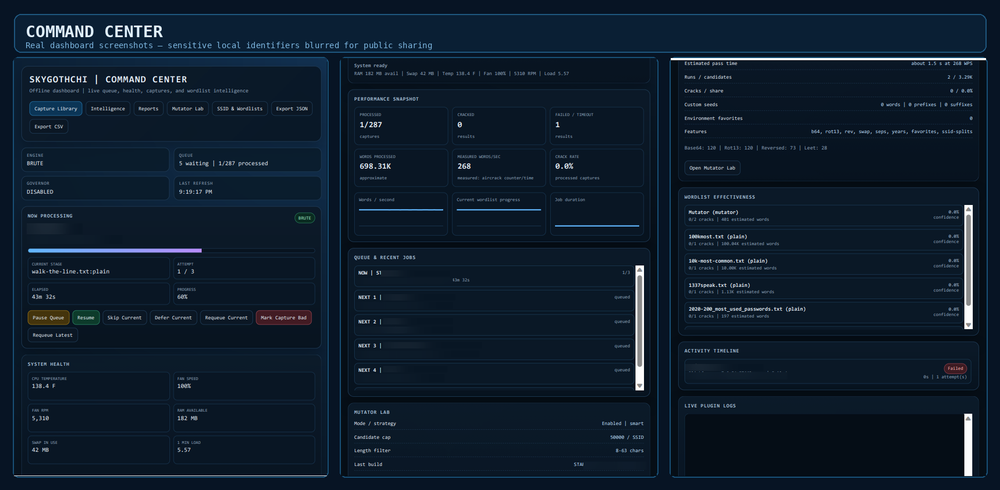
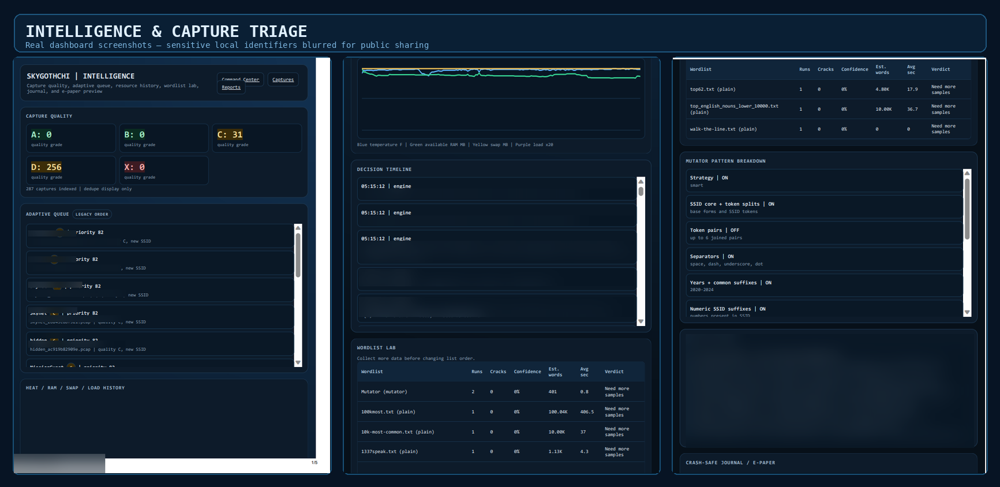
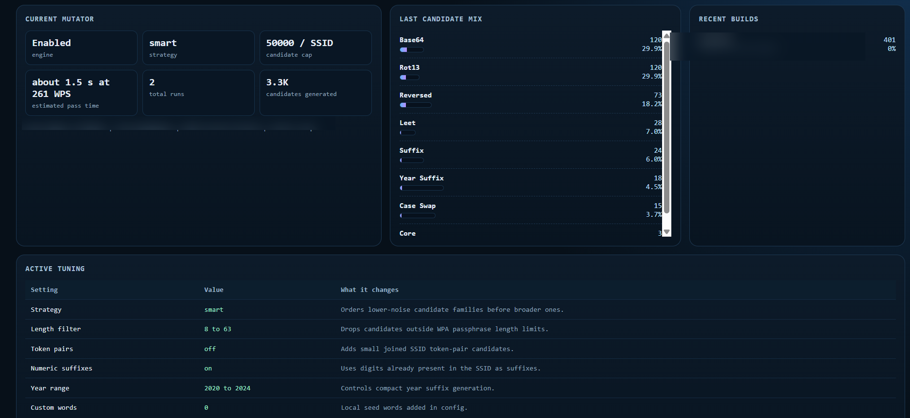

<p align="center">
  
</p>

<h1 align="center">Pwnagotchi BruteForcer</h1>

<p align="center">
  <strong>Turn a Pwnagotchi into a local Command Center for capture triage, queue control, measured throughput, thermal awareness, and explainable job history.</strong>
</p>

<p align="center">
  <a href="CHANGELOG.md"></a>
  
  
  <a href="LICENSE"></a>
</p>

> **Authorized-use only.** BruteForcer is for recovery testing, security assessment, and lab work involving wireless networks and capture files you own or have explicit permission to assess. Do not use it on networks or credentials you are not authorized to test.

## A Pwnagotchi plugin that feels like a small appliance

BruteForcer gives a Pwnagotchi a real local control panel instead of leaving you with a pile of captures, terminal output, and guesswork.

```text
capture triage → queue decision → active job → measured performance → job history
```

It watches the configured capture directory, processes one queued job at a time, records what happened, and puts the useful stuff on one dashboard.

```text
http://<your-pwnagotchi-ip>:5000/
```

No cloud dashboard. No account. No extra machine required for the local view.

## Real dashboard screenshots

These are live screenshots from the project running on a Pi. Network names, capture filenames, identifiers, keys, and other local details are intentionally redacted before publishing.

### Command Center — live job, queue, health, and results

<p align="center">
  <a href="assets/screenshots/command-center-gallery.png">
    
  </a>
</p>

The Command Center puts the active job, progress, queue controls, measured words per second, system health, fan telemetry, wordlist effectiveness, activity timeline, and plugin logs in one local page.

### Intelligence — capture quality, queue reasoning, and history

<p align="center">
  <a href="assets/screenshots/intelligence-gallery.png">
    
  </a>
</p>

The Intelligence page adds capture grades, duplicate grouping, adaptive queue visibility, heat/RAM/swap/load history, a decision timeline, wordlist analytics, and an at-a-glance view of what the system is doing.

### Mutator Lab — transparent settings and workload visibility

<p align="center">
  <a href="assets/screenshots/mutator-lab.png">
    
  </a>
</p>

Instead of a black box, Mutator Lab exposes the active strategy, candidate cap, candidate-family mix, estimated pass time, recent builds, and exactly which options are enabled.

## What makes it different

| Instead of... | You get... |
|---|---|
| A folder full of unknown `.pcap` files | Capture grades, duplicate grouping, queue reasons, and review actions |
| A raw terminal counter you cannot fully trust | Measured WPS based on tested-key counters and elapsed time, with unverified terminal text called out separately |
| Wondering whether the Pi is cooking itself | CPU temperature, RAM, swap, load, PWM fan percentage, and tachometer RPM in the dashboard |
| Rerunning the same capture blindly | Persistent job history, capture status, retry tracking, and queue controls |
| A giant mystery candidate list | A capped Mutator Lab with strategy, enabled features, candidate-family mix, build history, and estimated workload |
| Losing context after a crash or reboot | An active-job journal and persistent state that make interrupted work explainable |

## Main features

### Command Center

- Local Flask dashboard on port `5000`
- Active capture, wordlist stage, retry state, and progress
- Queue controls: pause, resume, skip, defer, requeue, and mark a capture bad
- Recent activity log and job timeline
- Current, recent-average, and completed-job throughput metrics
- Compact number display for high counters such as `249.3K` and `1.3M`

### Capture Intelligence

- Capture quality grades: `A`, `B`, `C`, `D`, and `X`
- Plain-English reasons for grades and queue decisions
- Duplicate grouping with best-capture selection
- Pending, running, cracked, failed, timeout, deferred, bad, and review filters
- Capture Library page at `/captures`
- Intelligence page at `/intelligence`
- Reports page at `/reports`

### System awareness

- CPU temperature in Fahrenheit
- Free RAM, swap use, load average, and resource history
- Optional runtime governor behavior
- Fan telemetry with PWM percentage and tachometer RPM when the companion fan plugin is installed
- Current health summary next to the workload instead of buried in system commands

### Mutator Lab

- Smart, capped candidate generation designed to keep the workload predictable on a Pi
- Configurable strategy, candidate cap, years, token pairs, separators, numeric suffixes, and custom seed settings
- Candidate-family breakdown and recent build history
- Estimated pass duration based on measured device throughput
- Full Mutator Lab page at `/mutator`

### Reliability and reporting

- One-job-at-a-time processing
- Persistent progress and job history
- Retry tracking and crash-aware active-job journal
- Per-SSID history and per-wordlist analytics
- Exportable results and reports
- Optional companion fan telemetry plugin

## Quick start

1. Copy `Bruteforcer.py` to your Pwnagotchi custom plugin directory.
2. Add the `main.plugins.Bruteforcer.*` options from [`config.example.toml`](config.example.toml) to `/etc/pwnagotchi/config.toml`.
3. Restart Pwnagotchi.
4. Open `http://<your-pwnagotchi-ip>:5000/`.

The plugin filename and config prefix are intentionally case-sensitive:

```toml
main.plugins.Bruteforcer.enabled = true
```

Use the full device install and upgrade notes here:

- [Install / upgrade guide](docs/UPGRADING.md)
- [Verification checklist](docs/VERIFICATION.md)
- [GitHub update notes](docs/GITHUB_UPDATE.md)
- [Complete changelog](CHANGELOG.md)

## Project layout

```text
Bruteforcer.py                    # Main custom plugin
config.example.toml               # Example configuration
assets/screenshots/               # Redacted live dashboard screenshots
docs/                             # Upgrade, verification, and GitHub notes
extras/fan_control_telemetry.py  # Optional fan telemetry companion
CHANGELOG.md                      # Release history
```

## Built for people who like seeing the whole system

BruteForcer is for the Pwnagotchi builder who wants more than a status line:

- See what is running now.
- Know what is queued next and why.
- See whether the device is staying healthy.
- Understand what candidate generation is configured to do.
- Keep a history that makes failures and results explainable.

## Contributing and sharing

Bug reports, improvement ideas, device screenshots, and tested configuration notes are welcome. The most useful contributions are real-world Pi results: performance, thermal behavior, dashboard screenshots, and compatibility notes from authorized lab environments.

If this project is useful, star the repository and share it with the Pwnagotchi, Raspberry Pi, and responsible wireless-security communities.

## License

This project is released under the [GNU General Public License v3.0](LICENSE).
